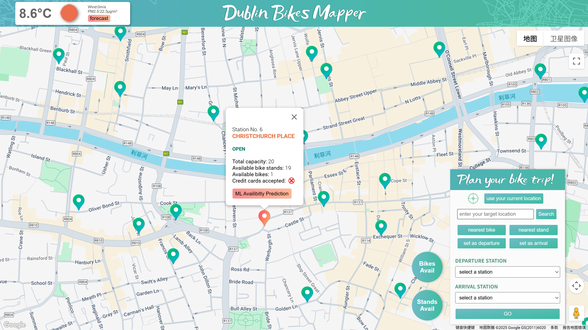
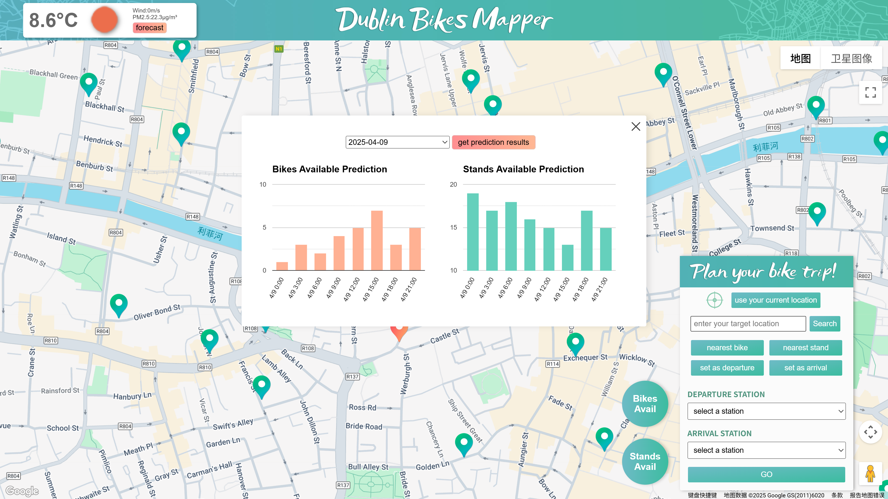
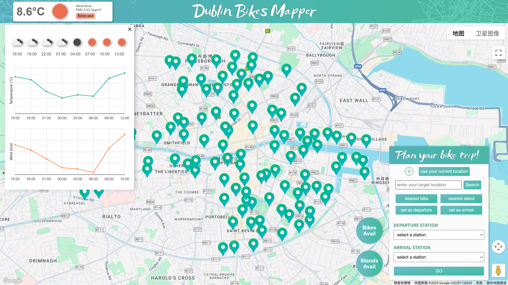
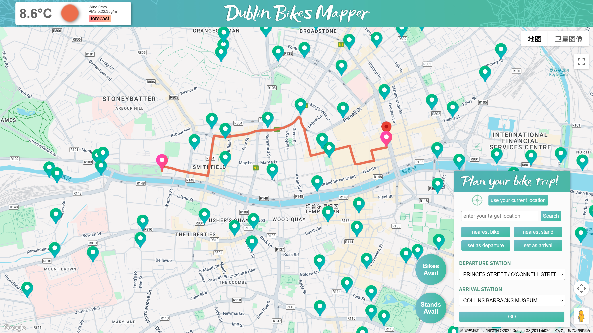

### Dublin Bikes Mapper – Smart Bike Monitoring & Prediction Platform

#### Project Overview

This project presents a comprehensive web-based system designed for Dublin’s public bike-sharing network. It integrates real-time data from bike stations, weather and air quality APIs, and applies machine learning models to forecast future bike availability. 

We first collected two months of historical data on bikes and weather conditions. The data was preprocessed and used to train models that forecast future bike and stand availability. We then developed the core application features and subsequently deployed the system on an AWS EC2 instance, with data stored and managed in an AWS RDS database. On the server, background services continuously run—scrapers fetch the latest real-time data, and a scheduled prediction module regularly updates the machine learning forecasts displayed on the website.

This project was initially developed through a team collaboration and later independently restructured and redeployed. My responsibilities included full-stack development and deployment. A detailed breakdown of my contributions is provided in the final section of this document.

---

#### Website

[https://dublinbikes.site](https://dublinbikes.site)

http://18.210.29.145/

---

####  Tech Stack

- **Frontend**: HTML, CSS, JavaScript, Google Maps Platform, Google Charts
- **Backend**: Python, Flask, SQLAlchemy, Flask-CORS
- **Database**: AWS RDS (MySQL)
- **Scrapers**: Python scripts for live data collection from JCDecaux and OpenWeatherMap APIs
- **Machine Learning**: Station-specific Linear Regression models trained with collected data
- **Deployment**: AWS EC2, Nginx

####  Project Structure

```
dbbikes/
├── app/
│   ├── ml/                   # Scripts for applying ML models to generate predictions
│   ├── ML_models/            # Saved ML model files (.joblib)
│   ├── scraper/              # Data scrapers for weather, air quality, stations etc.
│   ├── static/               # Front-end static files (CSS, JS, images)
│   ├── templates/            # HTML templates for Flask rendering
│   ├── app.py                # Main Flask application entry point
│   ├── config.py             # Configuration loader from .env
│   └── .env                  # Environment variables (excluded from Git)
├── notebooks/                # Jupyter notebooks used for ML model training and preparation
├── requirements.txt          # Python dependency list
├── .gitignore                # Git ignore rules
└── README.md                 # Project overview and instructions
```

---

#### Key Features

**● Displaying all the bike stations in Dublin**

Upon loading the website, all Dublin bike stations are displayed on the map, providing users with a clear overview of their distribution. Clicking on a station marker reveals an info box with key details, including station name and number, status, total capacity, real-time bike and stand availability, credit card support.





● **Machine Learning Prediction feature for Bikes and Stands**

When users click the “ML Availability Prediction” button on a selected station, the system displays bar charts forecasting the number of available bikes and stands over the next four days, helping users plan future trips.




**● Weather forecast feature**

The top-left widget displays current weather conditions. Clicking it reveals 24-hour forecast charts for temperature and wind speed.




**● Real-Time Bike & Stand Distribution**

Users can toggle between "Bikes Avail" and "Stands Avail" views to display the real-time availability of bikes or bike stands across all stations. Availability is represented by colored circles on the map, where size indicates quantity and color reflects availability levels. A legend in the top-left corner provides reference.


**● Route Planning Between Stations**

Users can select any two bike stations — one as the departure point and one as the destination — to generate a suggested cycling route between them. 



#### Personal Contributions

This project was initially developed by a team of three—Sha Luo, Yanwen Yu, and Thomas Pollock—as part of an academic Agile-based collaboration, and was taken offline after submission. Following that, I independently  revived, refined, and redeployed the system. . 

#### - Initial Contribution (Team Phase)

As a core contributor, I was responsible for the following areas:

- **Website Design**: I designed a large portion of the site’s visual theme, including the color palette, logo, background images, and custom station marker icons.
- **Front-End Development**: I implemented most of the front-end functionality using HTML, CSS, and JavaScript. Key features include: weather widgets and multi-day forecasts, map display, user geolocation, nearest station detection, route planning, and a heatmap visualization of bike and stand availability.

- **Back-End Development**:  I developed two scrapers for collecting air quality and weather forecast data, and designed the corresponding RDS table schemas. I used pre-trained machine learning models to generate predictions of bike and stand availability, and structured a dedicated table to store the outputs.

- **Deployment & Background Services**: I deployed the application to an AWS EC2 instance and configured background services to ensure continuous data scraping and system uptime.

#### - Independent Extension (Post-Project)

Following the completion and decommissioning of the initial group project, I independently revived, refined, and redeployed the system. My post-project contributions include:

- **New Database Infrastructure**: Set up a new AWS RDS instance with separated schemas.
- **Server Deployment and Configuration**: Launched a new EC2 instance, configured the virtual environment, and set up background services using `systemd` and `nohup`.
- **Custom Domain Setup**: Registered and mapped the domain `dublinbikes.site` to the EC2 server, with full DNS and Nginx configuration.
- **Project Cleanup & Configuration**: Reorganized the project structure, centralized environment variables with `.env` and `config.py`, cleaned the `.gitignore`, removed sensitive files from version control, and rewrote the README.
